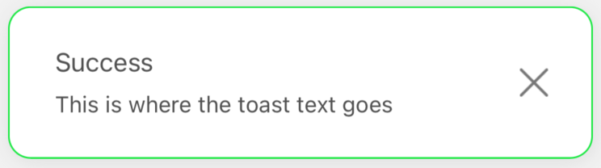

# Default Variants

At the start, you receive from us default styling for all 4 types of notifications (`success` / `error` / `warning` / `info`). <br/>
If you just trigger the notification, like in the example below (we trigger the `error` here, but of course it can be any notification):
#
```jsx
import React from 'react'
import { SafeAreaView, Text } from 'react-native'
import { createNotifications } from 'react-native-notification'
import { styles } from './styles'

const { useNotifications, NotificationsProvider } = createNotifications()

export const GlobalConfigExamples = () => {
  const { notify } = useNotifications()

  return (
    <SafeAreaView style={styles.container}>
      <NotificationsProvider />
      <Text
        onPress={() =>
          notify('error', {
            description: 'This is where the toast text goes. ',
            title: 'Error',
          })
        }>
        Emit error
      </Text>
    </SafeAreaView>
  )
}

```
#
You will get the basic styling with the `borderType` set for the `'border'` value, the `darkMode` set to `false`, and the `defaultIconType` for the `color` value. <br/>
(TO CHECK `borderType` AND OTHER STYLE PROPS GO TO THE [GLOBAL STYLES SETTINGS](./global-config.md) OR [SINGLE NOTIFICATION CONFIG](./props-config.md)).
Below you will find all the default combinations. You can get them just by changing 3 settings:

- `darkMode`
- `borderType`
- `defaultIconType`

| NotificationType  | `darkMode`         | `borderType`       | `defaultIconType`    | Visualisation
| ----------------- | ------------------ | ------------------ | -----------------    | -----------------
| Success           | `false`            | `'border'`         | `'color'`            | 
| Success           | `false`            | `'accent'`         | `'color'`            | 
| Success           | `false`            | `'no-border'`      | `'color'`            | 
| Success           | `false`            | `'no-border'`      | `'monochromatic'`    | 
| Success           | `false`            | `'border'`         | `'no-icon'`          | 
| Success           | `true`             | `'border'`         | `'color'`            | 
| Success           | `true`             | `'accent'`         | `'color'`            | 
| Success           | `true`             | `'no-border'`      | `'color'`            | 
| Success           | `true`             | `'no-border'`      | `'monochromatic'`    | 
| Success           | `true`             | `'border'`         | `'no-icon'`          | 
|                   |                    |                    |                      |
| Error             | `false`            | `'border'`         | `'color'`            | 
| Error             | `false`            | `'accent'`         | `'color'`            | 
| Error             | `false`            | `'no-border'`      | `'color'`            | 
| Error             | `false`            | `'border'`         | `'monochromatic'`    | 
| Error             | `false`            | `'border'`         | `'no-icon'`          | 
| Error             | `true`             | `'border'`         | `'color'`            | 
| Error             | `true`             | `'accent'`         | `'color'`            | 
| Error             | `true`             | `'no-border'`      | `'color'`            | 
| Error             | `true`             | `'border'`         | `'monochromatic'`    | 
| Error             | `true`             | `'border'`         | `'no-icon'`          | 
|                   |                    |                    |                      |
| Warning           | `false`            | `'border'`         | `'color'`            | 
| Warning           | `false`            | `'accent'`         | `'color'`            | 
| Warning           | `false`            | `'no-border'`      | `'color'`            | 
| Warning           | `false`            | `'border'`         | `'monochromatic'`    | 
| Warning           | `false`            | `'border'`         | `'no-icon'`          | 
| Warning           | `true`             | `'border'`         | `'color'`            | 
| Warning           | `true`             | `'accent'`         | `'color'`            | 
| Warning           | `true`             | `'no-border'`      | `'color'`            | 
| Warning           | `true`             | `'border'`         | `'monochromatic'`    | 
| Warning           | `true`             | `'border'`         | `'no-icon'`          | 
|                   |                    |                    |                      |
| Info              | `false`            | `'border'`         | `'color'`            | 
| Info              | `false`            | `'accent'`         | `'color'`            | 
| Info              | `false`            | `'no-border'`      | `'color'`            | 
| Info              | `false`            | `'border'`         | `'monochromatic'`    | 
| Info              | `false`            | `'border'`         | `'no-icon'`          | 
| Info              | `true`             | `'border'`         | `'color'`            | 
| Info              | `true`             | `'accent'`         | `'color'`            | 
| Info              | `true`             | `'no-border'`      | `'color'`            | 
| Info              | `true`             | `'border'`         | `'monochromatic'`    | 
| Info              | `true`             | `'border'`         | `'no-icon'`          | 
