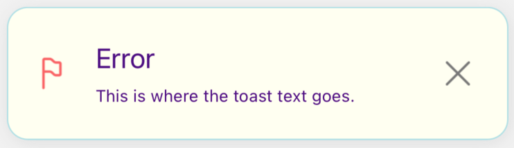

# 📬 Single Notification Config

<br/>

Besides global settings, you can also pass props to the notification instance.<br/>
PROPS `description` IS REQUIRED. <br/>
There are two main props you can pass to the notification:

- params
- config

```typescript jsx
    <Text
        onPress={() =>
          notify('error', {
            params: {},
            config: {},
          },
        )}
    >
```

Let's take a look at the `params` object properties:

| Name        | Type     | Default | Description                                                                                                                                                                                                       |
| ----------- | -------- | ------- | ----------------------------------------------------------------------------------------------------------------------------------------------------------------------------------------------------------------- |
| title       | String   | ''      | Props you can use to pass the notification title. Most of the notifications have the title, but this is not required.                                                                                             |
| description | String   | ''      | Props you can use to pass the notification description. This props is required!                                                                                                                                   |
| onPress     | Function | -       | The onPress props gives you possibility to pass extra function, which will be invoked when you use 'X' to close the notification                                                                                  |
| style       | Object   | -       | Object with the style properties. You can pass here style settings which will be applied only to this notification instance. Style properties passed here overwrites style settings from `defaultStylesSettings`. |

```typescript jsx
    <Text
        onPress={() =>
          notify('error', {
            params: {
              title: '',
              description: '',
              onPress: () => {},
              style: {},
            },
            config: {},
          },
        )}
    >
```

And at the `config` object:

| Name                 | Type                        | Default                  | Description                                                                                                                                                                                                                                                      |
| -------------------- | --------------------------- | ------------------------ | ---------------------------------------------------------------------------------------------------------------------------------------------------------------------------------------------------------------------------------------------------------------- |
| duration             | Number                      | 3000                     | Use this property to set how long the notifications should be displayed on the screen. Value expressed in milliseconds                                                                                                                                           |
| notificationPosition | 'top' / 'center' / 'bottom' | 'top'                    | Set where the notifications should appear on the screen. You can choose one of three default options: top / center / bottom. To read more about the notification position please go to the [NOTIFICATION POSITION](../default-variants-config/position) section. |
| animationConfig      | Object                      | SlideInLeftSlideOutRight | Property responsible for the notification animation. You can set one of the animations prepared by us, or make your own config. To read more about the animation settings please go to the [ANIMATIONS SETTINGS](../animations/changing-transitions) section.    |
| onClose              | Function                    | -                        | The onClose config option gives you possibility to pass an extra function, which will be invoked upon dismissal of the notification (triggered by swipe gesture, `remove` method - e.g. close button in default variants or when notification disappears)        |
|                      |

```typescript jsx
    <Text
        onPress={() =>
          notify('error', {
            params: {},
            config: {
              duration: 100,
              notificationPosition: 'top',
              animationConfig: {},
              onClose: () => {}
            },
          },
        )}
    >
```

<br/>
<br/>

## ✨ Style props

As we said above, in the `style` we can pass style settings for the notification instance. <br/>
In fact `style` props have the same properties as the `globalConfig`, `successConfig`, `errorConfig`, `warningConfig`, `infoConfig`.
Check the [GLOBAL STYLES SETTINGS](./global-config.md)

| Name             | Type                                        | Default                                                                                                      | Description                                                                                                                    |
| ---------------- | ------------------------------------------- | ------------------------------------------------------------------------------------------------------------ | ------------------------------------------------------------------------------------------------------------------------------ |
| titleSize        | Number                                      | `16`                                                                                                         | Set font size for the notification title                                                                                       |
| titleColor       | String                                      | `'#505050'` (darkMode - false) / `'#FAFAFA'` (darkMode - true)                                               | Set font color for the notification title                                                                                      |
| descriptionSize  | Number                                      | `14`                                                                                                         | Set font size for the notification description                                                                                 |
| descriptionColor | String                                      | `'#505050'` (darkMode - false) / `'#FAFAFA'` (darkMode - true)                                               | Set font color for the notification description                                                                                |
| bgColor          | String                                      | `'#FFFFFF'` (darkMode - false) / `'#2D2D2D'` (darkMode - true)                                               | Set background color for the notification                                                                                      |
| borderType       | `'border'` / `'accent'` / `'no-border'`     | `'border'`                                                                                                   | Set type of border for the notification ([EXAMPLES](#border-types-examples))                                                   |
| accentColor      | String                                      | `'#00EA33'` (success type) / `'#FC6060'` (error type) / `'#8CACFF'` (warning type) / `'#FFD37D'` (info type) | Set accent color for the notification. The color of the border or the left side accent line                                    |
| borderRadius     | Number                                      | `14`                                                                                                         | Set border radius for the notification container                                                                               |
| borderWidth      | Number                                      | `1`                                                                                                          | Set border width for the notification container                                                                                |
| multiline        | Number                                      | `1`                                                                                                          | Set number of visible lines for the notification description                                                                   |
| defaultIconType  | `'color'` / `'monochromatic'` / `'no-icon'` | `'color'`                                                                                                    | This props works only with default icons. If you set your own icon it has no effect. ([EXAMPLES](#default-icon-type-examples)) |
| leftIconSource   | ImageSourcePropType                         | -                                                                                                            | Set custom left icon for the notification (in png). For example. `require(../assets/icon.png)`                                 |

What is important here is that the `style` props overwrite the styles passed in `defaultStylesSettings`. <br/>
To understand it perfectly, let's take a look at the few examples below.

<br/>
<br/>

## 🖌️ Style overwriting example

```jsx
import React from 'react'
import { SafeAreaView, Text } from 'react-native'
import { createNotifications } from 'react-native-notification'
import { styles } from './styles'

const { useNotifications, NotificationsProvider } = createNotifications({
  defaultStylesSettings: {
    globalConfig: {
      titleSize: 20,
      titleColor: '#4B0082',
      descriptionSize: 12,
      descriptionColor: '#B0E0E6',
      bgColor: '#FFFFF0',
      borderRadius: 25,
      accentColor: '#4B0082',
      borderWidth: 3,
      multiline: 5,
    },
    errorConfig: {
      descriptionSize: 12,
      descriptionColor: '#4B0082',
      accentColor: '#B0E0E6',
      borderWidth: 2,
      multiline: 10,
    },
  },
})

export const GlobalConfigExamples = () => {
  const { notify } = useNotifications()

  return (
    <SafeAreaView style={styles.container}>
      <NotificationsProvider />
      <Text
        onPress={() =>
          notify('error', {
            params: {
              description: 'This is where the toast text goes. ',
              title: 'Error',
              style: {
                borderRadius: 15,
                borderWidth: 1,
              },
            },
          })
        }>
        Emit error
      </Text>
    </SafeAreaView>
  )
}
```

In the beginning, in the `globalConfig`, we have overwritten default settings:

- titleSize
- titleColor
- descriptionSize
- descriptionColor
- bgColor
- borderRadius
- accentColor
- borderWidth
- multiline

In the `errorConfig` we have overwritten:

- descriptionSize
- descriptionColor
- accentColor
- borderWidth
- multiline

And in `style` we have overwritten:

- borderRadius
- accentColor
- borderWidth

So the final style setting for this `error` notification is:

```jsx
{
    titleSize: 20,
    titleColor: '#4B0082',
    descriptionSize: 12,
    descriptionColor: '#4B0082',
    bgColor: '#FFFFF0',
    borderRadius: 15,
    borderWidth: 1,
    accentColor: '#B0E0E6',
    multiline: 10
}
```

Remember that `title`, `description` and `onPress` are not the styling props. <br/>
<br/>
And the final effect:
<br/>
<br/>



<br/>
<br/>

So in conclusion -<br/>

- `style` object overwrites `successConfig` / `errorConfig` / `warningConfig` / `infoConfig`(depends on which notification type are you using and styling), `globalConfig`, and DEFAULT SETTINGS<br/>
- `successConfig` / `errorConfig` / `warningConfig` / `infoConfig` overwrites `globalConfig`, and DEFAULT SETTINGS<br/>
- `globalConfig` overwrites DEFAULT SETTINGS
