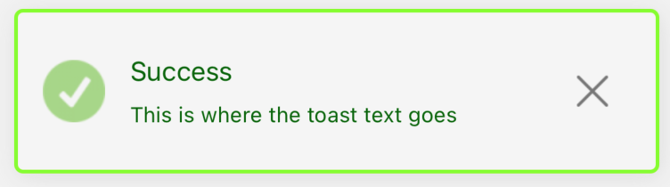
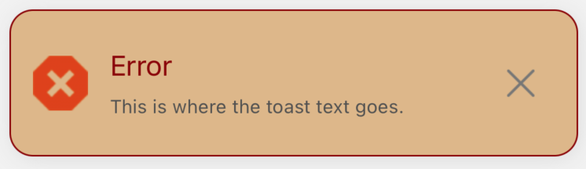

# 🖋️ Global types config examples
<br/>

Code has been already described step by step in the [DEFAULT EXAMPLES](./default-examples.md) section.<br/>
So I think there is no use to do it here again.<br/>
Here we have only few differences I need to mention, and they are minimal:

- we use `modify()` and `remove()` only if the [DEFAULT EXAMPLES](./default-examples.md) because their usage is limited, and the explanation there is all we need to know. We can remove notification, or modify it. So, we will not use them here and in the other examples. Because of the same reason we will not use `useState` and `useNotificationController` here.
- we filled the `successConfig`, `errorConfig`, `warningConfig` and the `infoConfig` objects in the `defaultStylesSettings`. Those objects are responsible for setting properties for all notifications in the given type. To read more please go back to the [GLOBAL CONFIG](../default-variants-config/global-config.md) section.
  <br/>

In fact that's the only differences between Default Examples and Global Types Config Examples.<br/>
Let's take a look at the code and the visualisations then:


## Code

```jsx
import React from 'react'
import { SafeAreaView } from 'react-native'
import { createNotifications } from 'react-native-notification'
import { SuccessButton } from '../components/basicExamples/SuccessButton'
import { ErrorButton } from '../components/basicExamples/ErrorButton'
import { WarningButton } from '../components/basicExamples/WarningButton'
import { InfoButton } from '../components/basicExamples/InfoButton'
import { styles } from './styles'

const { useNotifications, NotificationsProvider } = createNotifications({
  isNotch: true,
  defaultStylesSettings: {
    successConfig: {
      leftIconSource: require('../../assets/custom-success-icon.png'),
      titleSize: 15,
      titleColor: '#006400',
      descriptionSize: 12,
      descriptionColor: '#006400',
      bgColor: '#F5F5F5',
      borderRadius: 5,
      accentColor: '#7FFF00',
      borderWidth: 2,
    },
    errorConfig: {
      leftIconSource: require('../../assets/custom-error-icon.png'),
      titleSize: 18,
      titleColor: '#8B0000',
      descriptionSize: 12,
      bgColor: '#DEB887',
      borderRadius: 15,
      accentColor: '#8B0000',
    },
    warningConfig: {
      leftIconSource: require('../../assets/custom-warning-icon.png'),
      titleSize: 20,
      titleColor: '#fff',
      descriptionSize: 14,
      descriptionColor: '#fff',
      bgColor: '#191970',
      borderRadius: 10,
      accentColor: '#FF8C00',
      borderWidth: 3,
      multiline: 3,
    },
    infoConfig: {
      leftIconSource: require('../../assets/custom-info-icon.png'),
      titleSize: 20,
      titleColor: '#1E90FF',
      descriptionSize: 14,
      descriptionColor: '#1E90FF',
      borderWidth: 0,
      multiline: 4,
    },
  },
})

export const GlobalTypesConfigExamples = () => {
  const { notify } = useNotifications()

  return (
    <SafeAreaView style={styles.container}>
      <NotificationsProvider />
      <SuccessButton
        onPress={() =>
          notify('success', {
            params: {
              description: 'This is where the toast text goes',
              title: 'Success',
            },
          })
        }
      />
      <ErrorButton
        onPress={() =>
          notify('error', {
            params: {
              description: 'This is where the toast text goes. ',
              title: 'Error',
            },
          })
        }
      />
      <WarningButton
        onPress={() =>
          notify('warning', {
            params: {
              description: 'This is where the toast text goes',
              title: 'Warning',
            },
          })
        }
      />
      <InfoButton
        onPress={() =>
          notify('info', {
            params: {
              description: 'This is where the toast text goes.',
              title: 'Info',
            },
          })
        }
      />
    </SafeAreaView>
  )
}


```

<br/>

## Visualization of examples

Let's see the notifications we declared above:

<br/>

### Success notification



### Error notification



### Warning notification


### Info notification


<br/>

## Conclusion

All the notifications in the same type, will have the same style properties.<br/>
What is important, the `successConfig`, `errorConfig`, `warningConfig` and the `infoConfig` overwrites the `globalConfig` setting, but only for their own types.<br/>
To read more please go back to the [GLOBAL CONFIG](../default-variants-config/global-config.md)<br/> and the [ORDER OF SETTINGS OVERWRITING](../comprehensive-configuration/order-of-settings-overwriting.md) sections.
