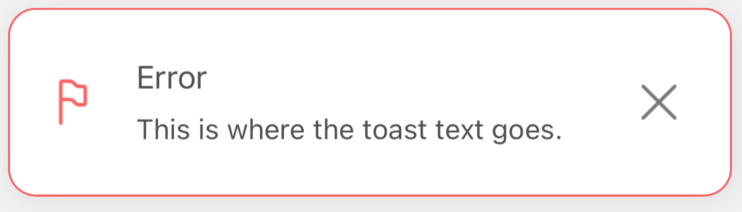
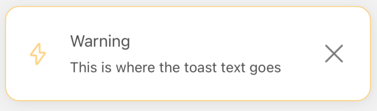
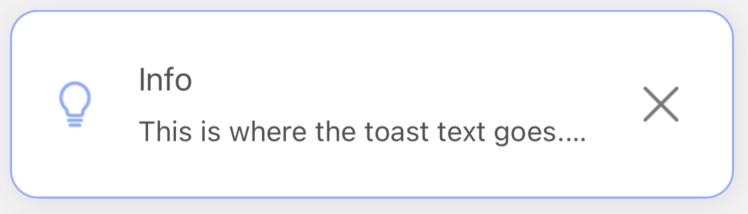

# 🖼️ Default Variants

## 🖌️ Default Notification Styling

<br/>

At the start, you receive from us default styling, for all 4 types of notifications (`success` / `error` / `warning` / `info`). <br/>
If you just trigger the notification, like in the example below (we trigger the `error` here, but of course, it can be any other notification):

#

```jsx
import React from 'react'
import { SafeAreaView, Text } from 'react-native'
import { createNotifications } from 'react-native-notificated'
import { styles } from './styles'

const { useNotifications, NotificationsProvider } = createNotifications()

export const GlobalConfigExamples = () => {
  const { notify } = useNotifications()

  return (
    <SafeAreaView style={styles.container}>
      <NotificationsProvider />
      <Text
        onPress={() =>
          notify('error', {
            params: {
              description: 'This is where the toast text goes. ',
              title: 'Error',
            },
          })
        }>
        Emit error
      </Text>
    </SafeAreaView>
  )
}
```

#

You will get the basic styling with the `borderType` set for the `'border'` value, the `darkMode` set to `false`, and the `defaultIconType` for the `color` value. <br/>

#

(TO CHECK `borderType` AND OTHER STYLE PROPS GO TO THE [GLOBAL STYLES SETTINGS](./global-config.md) OR [SINGLE NOTIFICATION CONFIG](./props-config.md)).

#

Below you will find the default styling for all notification types with `darkMode` set to false and true for all variants.

| NotificationType | `darkMode` | Visualisation                                   |
| ---------------- | ---------- | ----------------------------------------------- |
| Success          | `false`    |            |
| Success          | `true`     |  |
|                  |            |
| Error            | `false`    |             |
| Error            | `true`     |    |
|                  |            |
| Warning          | `false`    |           |
| Warning          | `true`     |  |
|                  |            |
| Info             | `false`    |              |
| Info             | `true`     |     |
