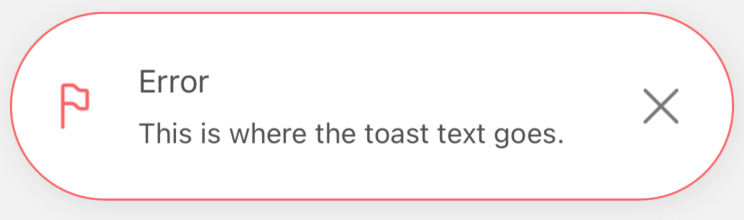

# 🌍 Global Styles Settings
####

## 🎨 Default styles settings

In default styles settings, we can pass the config that affects all the notifications udes in the app ([EXAMPLES OF GLOBAL STYLES SETTINGS](#global-styles-setting-examples)).
We divide them into:

| Name             | Type             | Default  | Description                                                                                                                                                            |
| ---------------- |----------------- | -------- | ---------------------------------------------------------------------------------------------------------------------------------------------------------------------- |
| darkMode         | Boolean          | false    | If set for `true` enables the dark mode for the layout of the notification
| globalConfig     | Object           | -        | Inside this object, you can pass the configuration for all notifications used in the app (or part wrapped by the `NotificationProvider`)
| successConfig    | Object           | -        | Inside this object, you can pass the configuration for all success type notifications used in the app (or part wrapped by the `NotificationProvider`). All params set for the success notifications here overwrites the same params set in `globalConfig`
| errorConfig      | Object           | -        | Inside this object, you can pass the configuration for all error type notifications used in the app (or part wrapped by the `NotificationProvider`). All params set for the error notifications here overwrites the same params set in `globalConfig`
| warningConfig    | Object           | -        | Inside this object, you can pass the configuration for all warning type notifications used in the app (or part wrapped by the `NotificationProvider`). All params set for the warning notifications here overwrites the same params set in `globalConfig`
| infoConfig       | Object           | -        | Inside this object, you can pass the configuration for all info type notifications used in the app (or part wrapped by the `NotificationProvider`). All params set for the info notifications here overwrites the same params set in `globalConfig`

#

```jsx
const {useNotifications, NotificationsProvider} = createNotifications({
    defaultStylesSettings: {
        darkMode: true,
        globalConfig: {},
        successConfig: {},
        errorConfig: {},
        warningConfig: {},
        infoConfig: {},
    },
})
```

#

Like we said above - in the config descriptions, `globalConfig` even if is set can be overwritten by the config of the different notifications types (`successConfig` / `errorConfig` / `warningConfig` / `infoConfig`).
You can find examples explaining it below, but first, let's find out what exactly, can we set in config objects.
#
<br/>

## ⚙️ Style config object


All five configs:

- `globalConfig`
- `successConfig`
- `errorConfig`
- `warningConfig`
- `infoConfig`

are the objects with the same properties.
#
We can set there:

| Name             | Type                                        | Default                                                                                                      | Description                                                                                    |
| ---------------- |-------------------------------------------- | ------------------------------------------------------------------------------------------------------------ | ---------------------------------------------------------------------------------------------- |
| titleSize        | Number                                      | `16`                                                                                                         | Set font size for the notification title
| titleColor       | String                                      | `'#505050'` (darkMode - false) / `'#FAFAFA'` (darkMode - true)                                               | Set font color for the notification title
| descriptionSize  | Number                                      | `14`                                                                                                         | Set font size for the notification description
| descriptionColor | String                                      | `'#505050'` (darkMode - false) / `'#FAFAFA'` (darkMode - true)                                               | Set font color for the notification description
| bgColor          | String                                      | `'#FFFFFF'` (darkMode - false) / `'#2D2D2D'` (darkMode - true)                                               | Set background color for the notification
| borderType       | `'border'` / `'accent'` / `'no-border'`     | `'border'`                                                                                                   | Set type of border for the notification ([EXAMPLES](#border-types-examples))
| accentColor      | String                                      | `'#00EA33'` (success type) / `'#FC6060'` (error type) / `'#8CACFF'` (warning type) / `'#FFD37D'` (info type) | Set accent color for the notification. The color of the border or the left side accent line
| borderRadius     | Number                                      | `14`                                                                                                         | Set border radius for the notification container
| borderWidth      | Number                                      | `1`                                                                                                          | Set border width for the notification container
| multiline        | Number                                      | `1`                                                                                                          | Set number of visible lines for the notification description
| defaultIconType  | `'color'` / `'monochromatic'` / `'no-icon'` | `'color'`                                                                                                    | This props works only with default icons. If you set your own icon it has no effect. ([EXAMPLES](#default-icon-type-examples))
| leftIconSource   | ImageSourcePropType                         | -                                                                                                            | Set custom left icon for the notification (in png). For example. `require(../assets/icon.png)`

##
### 🔳 Border types examples

- `'border'`
#
  

- `'accent'`
#
  

- `'no-border'`
#
  

##
### 🏵️ Default icon type examples

- `'color'`
#


- `'monochromatic'`
#


- `'monochromatic'` (dark mode)
#


- `'no-icon'`
#


##
## 🏞️ Global styles setting examples

Let's start with the basic notification settings with some global style.
<br/>

### 🌐 `globalConfig`

```jsx
import React from 'react'
import { SafeAreaView, Text } from 'react-native'
import { createNotifications } from 'react-native-notification'
import { styles } from './styles'

const { useNotifications, NotificationsProvider } = createNotifications({
  defaultStylesSettings: {
    globalConfig: {
      titleSize: 20,
      titleColor: '#4B0082',
      descriptionSize: 12,
      descriptionColor: '#4B0082',
      bgColor: '#FFFFF0',
      borderType: 'accent',
      borderRadius: 25,
      accentColor: '#B0E0E6',
      borderWidth: 3,
      multiline: 5,
      leftIconSource: require('../assets/custom-icon.png'),
    },
  },
})

export const GlobalConfigExamples = () => {
  const { notify } = useNotifications()

  return (
    <SafeAreaView style={styles.container}>
      <NotificationsProvider />
      <Text
        onPress={() =>
          notify('error', {
            params: {
              description: 'This is where the toast text goes. ',
              title: 'Error',
            },
          })
        }>
        Emit error
      </Text>
    </SafeAreaView>
  )
}

```

The effect is visible below:


In `globalConfig` above, we have overwritten all the default values.
#
That means that doesn't matter now if we use `error` or `info` notification. All will now look the same.
That is what `globalConfig` does. It overwrites properties for all the notifications.
If we set there only `borderRadius` property for some value, then only `borderRadius` would be set global. Default values of all other properties would stay untouched:
#

```jsx
import React from 'react'
import { SafeAreaView, Text } from 'react-native'
import { createNotifications } from 'react-native-notification'
import { styles } from './styles'

const { useNotifications, NotificationsProvider } = createNotifications({
  defaultStylesSettings: {
    globalConfig: {
      borderRadius: 50,
    },
  },
})

export const GlobalConfigExamples = () => {
  const { notify } = useNotifications()

  return (
    <SafeAreaView style={styles.container}>
      <NotificationsProvider />
      <Text
        onPress={() =>
          notify('error', {
            params: {
              description: 'This is where the toast text goes. ',
              title: 'Error',
            },
          })
        }>
        Emit error
      </Text>
      <Text
        onPress={() =>
          notify('success', {
            params: {
              description: 'This is where the toast text goes. ',
              title: 'Success',
            },
          })
        }>
        Emit success
      </Text>
    </SafeAreaView>
  )
}

```




#

Both notifications - error and success - have their default settings. Only `borderRadius` has been changed for both of them because we did it in `globalConfig`.

##
### ℹ️ `successConfig` / `errorConfig` / `warningConfig` / `infoConfig`

Those settings work the same as `globalConfig` but for different notification types. <br/>
In other words, we can set configuration for ALL errors, ALL info, etc.

In addition `successConfig` / `errorConfig` / `warningConfig` / `infoConfig` are overwriting properties set in `globalConfig`.<br/>
So if we set `borderRadius` in `globalConfig` for `50` as we did in the example above, and we will overwrite it in the `successConfig` for `10`, then `borderRadius` for ALL the SUCCESS notifications will be set for `10`, but for ALL OTHER it still will be `50`.

```jsx
import React from 'react'
import { SafeAreaView, Text } from 'react-native'
import { createNotifications } from 'react-native-notification'
import { styles } from './styles'

const { useNotifications, NotificationsProvider } = createNotifications({
  defaultStylesSettings: {
    globalConfig: {
      borderRadius: 50,
    },
    successConfig: {
      borderRadius: 10,
    }
  },
})

export const GlobalConfigExamples = () => {
  const { notify } = useNotifications()

  return (
    <SafeAreaView style={styles.container}>
      <NotificationsProvider />
      <Text
        onPress={() =>
          notify('error', {
            params: {
              description: 'This is where the toast text goes. ',
              title: 'Error',
            },
          })
        }>
        Emit error
      </Text>
      <Text
        onPress={() =>
          notify('success', {
            params: {
              description: 'This is where the toast text goes. ',
              title: 'Success',
            },
          })
        }>
        Emit success
      </Text>
    </SafeAreaView>
  )
}
```


##

So in conclusion -
#
`successConfig` / `errorConfig` / `warningConfig` / `infoConfig` overwrites `globalConfig`, and DEFAULT SETTINGS
#
`globalConfig` overwrites DEFAULT SETTINGS

##

