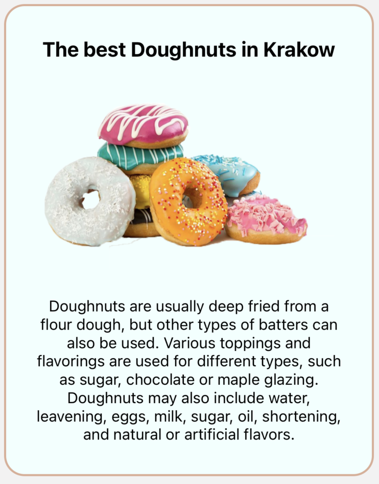

# ✍️ Custom components examples
<br/>

Code has been already described step by step in the [DEFAULT EXAMPLES](./default-examples.md) section.<br/>
So I think there is no need to do it here again.<br/>

In custom components examples, we will create our own modal, and pass it to the library.<br/>
Thanks to this, we will obtain the maximum possibility of customization, without losing library advantages.

Let's create our custom components:

## Custom modal - advertisement

```tsx
import React from 'react'
import { Image, Text, View } from 'react-native'
import { styles } from './styles'

type Props = {
  customTitle: string
  customDescription: string
}

export const Advertisement = ({ customTitle, customDescription }: Props) => {
  return (
    <View style={styles.advertisement_container}>
      <Text style={styles.advertisement_title}>{customTitle}</Text>
      <Image source={require('../../../../assets/doughnut.png')} style={styles.advertisement_image} />
      <Text style={styles.advertisement_description}>{customDescription}</Text>
    </View>
  )
}

```

## Custom modal - info

```tsx
import { Image, Text, View } from 'react-native'
import React from 'react'
import { styles } from './styles'

type Props = {
  customTitle: string
}

export const CustomInfo = ({ customTitle }: Props) => {
  return (
    <View style={styles.info_container}>
      <Text style={styles.info_title}>{customTitle}</Text>
      <Image source={require('../../../../assets/in_progress.png')} style={styles.info_image} />
    </View>
  )
}

```

## Styles for both custom modals

```ts
import { StyleSheet } from 'react-native'

export const styles = StyleSheet.create({
  advertisement_container: {
    flex: 1,
    backgroundColor: '#f0fffe',
    borderRadius: 20,
    borderWidth: 2,
    borderColor: '#DCAE96',
    justifyContent: 'center',
    alignItems: 'center',
    padding: 30,
  },
  advertisement_title: {
    fontSize: 20,
    fontWeight: 'bold',
  },
  advertisement_description: {
    fontSize: 15,
    textAlign: 'center',
  },
  advertisement_image: {
    resizeMode: 'center',
    height: 230,
  },
  info_container: {
    width: 360,
    height: 360,
    borderRadius: 180,
    backgroundColor: '#FFFFFF',
    borderWidth: 10,
    borderColor: '#000000',
    justifyContent: 'center',
    alignItems: 'center',
    padding: 30,
  },
  info_title: {
    fontSize: 24,
    fontWeight: 'bold',
    marginBottom: 20,
  },
  info_image: {
    width: 150,
    height: 150,
  },
})

```

<br/>

As you can see they're just very simple modals. <br/>
What we need to do next is to pass those modals to the library structure.<br/>
Please notice, that we pass props to those components. I will explain how to do it in the main component below.


## Main component

```tsx
import React from 'react'
import { SafeAreaView } from 'react-native'
import { createNotifications } from 'react-native-notification'
import { styles } from './styles'
import { Advertisement } from '../components/customVariants/Advertisement'
import { CustomInfo } from '../components/customVariants/CustomInfo'
import { CustomCaseButton } from '../components/customVariants/CustomCaseButton'

const { useNotifications, NotificationsProvider } = createNotifications({
  variants: {
    advertisement: {
      component: Advertisement,
      config: {
        notificationPosition: 'top',
        duration: 5000,
      },
    },
    custom_info: {
      component: CustomInfo,
      config: {
        duration: 2000,
      },
    },
  },
  isNotch: true,
})

export const CustomCaseExamples = () => {
  const { notify } = useNotifications()

  return (
    <SafeAreaView style={styles.container}>
      <NotificationsProvider />

      <CustomCaseButton
        buttonTitle="Advertisement"
        onPress={() =>
          notify('advertisement', {
            params: {
              customTitle: 'The best Doughnuts in Krakow',
              customDescription:
                'Doughnuts are usually deep fried from a flour dough, but other types of batters can also be used. Various toppings and flavorings are used for different types, such as sugar, chocolate or maple glazing. Doughnuts may also include water, leavening, eggs, milk, sugar, oil, shortening, and natural or artificial flavors.',
            },
            config: {
              duration: 2000,
            },
          })
        }
      />

      <CustomCaseButton
        buttonTitle="Custom Info"
        onPress={() =>
          notify('custom_info', {
            params: {
              customTitle: 'In progress',
            },
            config: {
              duration: 3000,
            },
          })
        }
      />
    </SafeAreaView>
  )
}

```

<br/>

The first step is to initialize process using `createNotifications`.<br/>
In the settings, we can use property `variants`.<br/>
This is the place where we will pass our components. Let's take a closer look at it:

```tsx
const { useNotifications, NotificationsProvider } = createNotifications({
  variants: {
    advertisement: {
      component: Advertisement,
      config: {
        notificationPosition: 'top',
        duration: 5000,
      },
    },
    custom_info: {
      component: CustomInfo,
      config: {
        duration: 2000,
      },
    },
  },
  isNotch: true,
})

```

`variants` is an object with the keys, which are the names of the variants we want to create.<br/>
In this case, we want to create advertisement, and the custom info, so I decided to use those names literally.<br/>
You can name your variant whatever you like. It can be 'modal' / 'lol' / 'my_precious_variant' etc. It depends on you. <br/>

Every custom variant in also an object where we need to pass our custom component, and optionally `config`. <br/>
Let's recall properties that `config` can take:

| Name                 | Type                        | Default                  | Description                                                                                                                                                                                                                                                      |
|----------------------|-----------------------------|--------------------------|------------------------------------------------------------------------------------------------------------------------------------------------------------------------------------------------------------------------------------------------------------------|
| duration             | Number                      | 3000                     | Use this property to set how long the notifications should be displayed on the screen. Value expressed in milliseconds                                                                                                                                           |
| notificationPosition | 'top' / 'center' / 'bottom' | 'top'                    | Set where the notifications should appear on the screen. You can choose one of three default options: top / center / bottom. To read more about the notification position please go to the [NOTIFICATION POSITION](../default-variants-config/position) section. |
| animationConfig      | Object                      | SlideInLeftSlideOutRight | Property responsible for the notification animation. You can set one of the animations prepared by us, or make your own config. To read more about the animation settings please go to the [ANIMATIONS SETTINGS](../animations/changing-transitions) section.    |

<br/>

Now, our custom modals are 'injected' inside the library, and we can use them, exactly in the same way as we did with default notifications (`success` / `error` / `info` / `warning`).

What is important, that when we pass the name of the notification, then instead of the `success` / `error` / `info` / `warning` we used before, now we need to pass name we declared in the `variants`. In my case they are the `advertisement` and the `custom_info`
It's a first argument we pass to the `notify`:

```jsx
<CustomCaseButton
  buttonTitle="Advertisement"
  onPress={() =>
    notify('advertisement', {
      params: {
        customTitle: 'The best Doughnuts in Krakow',
        customDescription:
          'Doughnuts are usually deep fried from a flour dough, but other types of batters can also be used. Various toppings and flavorings are used for different types, such as sugar, chocolate or maple glazing. Doughnuts may also include water, leavening, eggs, milk, sugar, oil, shortening, and natural or artificial flavors.',
      },
      config: {
        duration: 2000,
      },
    })
  }
/>
```

```jsx
<CustomCaseButton
  buttonTitle="Custom Info"
  onPress={() =>
    notify('custom_info', {
      params: {
        customTitle: 'In progress',
      },
      config: {
        duration: 3000,
      },
    })
  }
/>
```

After that we have `params`.<br/>
They are just literally the props we pass to our custom modal. <br/>
In the `CustomInfo` we require only `customTitle`, so we just need to pass this one to the `params`.<br/>

`config` is still have the 3 properties we recall above.
We can pass the `config` when we're 'injecting' our custom modal to the library, or when we call it. It depends on you. <br/>
Please remember that the `config` in the `notify` (when we call it) overwrites `config` that we declared in the 'injection' process.<br/>

### Implement close button
In case you need to implement close button in your custom component, here is the code showing implementation in out 'CustomInfo' notification:

```tsx
import { Image, Text, View } from 'react-native'
import { TouchableOpacity } from 'react-native-gesture-handler'
import React from 'react'
import { styles } from './styles'
import { useNotificationController } from 'react-native-notificated'

type Props = {
  customTitle: string
}

export const CustomInfo = ({ customTitle }: Props) => {
  const { remove } = useNotificationController()

  return (
    <View style={styles.info_container}>
      <Text style={styles.info_title}>{customTitle}</Text>
      <Image source={require('../../../../assets/in_progress.png')} style={styles.info_image} />
      <TouchableOpacity
        onPress={() => {
          remove()
        }}>
        <Image source={'../../../../assets/close-regularMode.png'} style={styles.icon} />
      </TouchableOpacity>
    </View>
  )
}

```

Now let's take a look how our examples looks like:

### Advertisement



### Custom info


