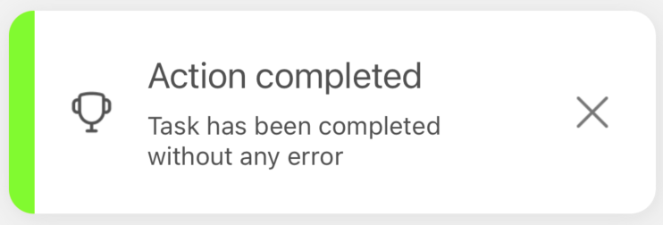
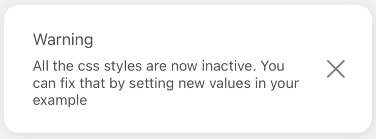
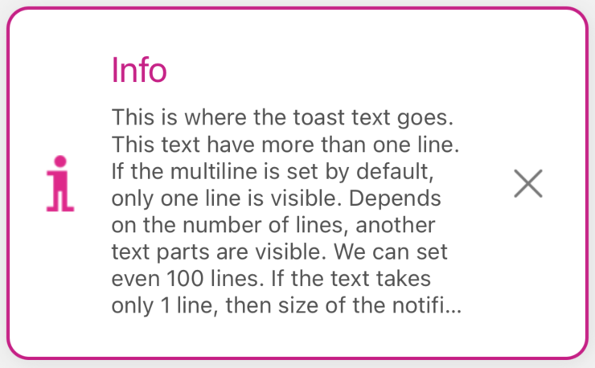

# 🪶 Custom examples
<br/>

Code has been already described step by step in the [DEFAULT EXAMPLES](./default-examples.md) section.<br/>
So I think there is no use to do it here again.<br/>
Here we have only a few differences I need to mention, and they are minimal:

- we use `modify()` and `remove()` only if the [DEFAULT EXAMPLES](./default-examples.md) because their usage is limited, and the explanation there is all we need to know. We can remove notification, or modify it. So, we will not use them here and in the other examples. Because of the same reason we will not use `useState` and `useNotificationController` here.
- we filled the `style` object in every notification. To read more about the single notification properties please go to the [SINGLE NOTIFICATION CONFIG](../default-variants-config/props-config.md) section.
  <br/>

In fact that's the only differences between Default Examples and Custom Examples.<br/>
Let's take a look at the code and the visualisations then:


## Code

```tsx
import React from 'react'
import { SafeAreaView } from 'react-native'
import { styles } from './styles'
import { createNotifications } from 'react-native-notification'
import { SuccessButton } from '../components/basicExamples/SuccessButton'
import { ErrorButton } from '../components/basicExamples/ErrorButton'
import { WarningButton } from '../components/basicExamples/WarningButton'
import { InfoButton } from '../components/basicExamples/InfoButton'

const { useNotifications, NotificationsProvider } = createNotifications({
  isNotch: true,
})

export const SingleCustomCases = () => {
  const { notify } = useNotifications()

  return (
    <SafeAreaView style={styles.container}>
      <NotificationsProvider />
      <SuccessButton
        onPress={() =>
          notify('success', {
            params: {
              description: 'Task has been completed without any error ',
              title: 'Action completed',
              style: {
                titleSize: 20,
                descriptionSize: 14,
                accentColor: '#7CFC00',
                borderType: 'accent',
                defaultIconType: 'monochromatic',
                multiline: 2,
              },
            },
          })
        }
      />
      <ErrorButton
        onPress={() =>
          notify('error', {
            params: {
              description: 'This error may damage your system. ',
              title: 'Integration error',
              style: {
                titleSize: 25,
                titleColor: '#FF0000',
                descriptionSize: 12,
                accentColor: '#FF0000',
                borderType: 'accent',
                defaultIconType: 'no-icon',
              },
            },
          })
        }
      />
      <WarningButton
        onPress={() =>
          notify('warning', {
            params: {
              description:
                'All the css styles are now inactive. You can fix that by setting new values in your example',
              title: 'Warning',
              style: {
                defaultIconType: 'no-icon',
                borderType: 'no-border',
                multiline: 3,
              },
            },
          })
        }
      />
      <InfoButton
        onPress={() =>
          notify('info', {
            params: {
              description:
                'This is where the toast text goes. This text have more than one line. If the multiline is set by default, only one line is visible. Depends on the number of lines, another text parts are visible. We can set even 100 lines. If the text takes only 1 line, then size of the notification will fit',
              title: 'Info',
              style: {
                titleSize: 22,
                titleColor: '#C71585',
                leftIconSource: require('../../assets/custom-info-icon-2.png'),
                multiline: 8,
                accentColor: '#C71585',
                borderWidth: 2,
              },
            },
          })
        }
      />
    </SafeAreaView>
  )
}

```

<br/>

## Visualization of examples

Let's see the notifications we declared above:

<br/>

### Success notification



### Error notification


### Warning notification



### Info notification




<br/>

## Conclusion

Like we can see every notification have its own style, but it's not going above this single notification. <br/>
What we should remember is that the single notification style overwrites each of those configs:

- `globalConfig`
- `successConfig`
- `errorConfig`
- `warningConfig`
- `infoConfig`

To read more please go to [SINGLE NOTIFICATION CONFIG](../default-variants-config/props-config.md) and the [ORDER OF SETTINGS OVERWRITING](../comprehensive-configuration/order-of-overwriting-settings.md) sections.
