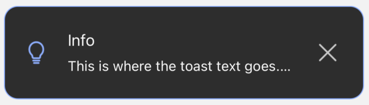

# 🖊️ Dark mode examples
<br/>

The code has been already described step by step in the [DEFAULT EXAMPLES](./default-examples.md) section, so I think there is no use to do it here again.<br/>
Here we have only a few differences I need to mention, and they are minimal:

- we use `modify()` and `remove()` only if the [DEFAULT EXAMPLES](./default-examples.md) because their usage is limited, and the explanation there is all we need to know. We can remove the notification or modify it. So, we will not use them here and in the other examples. For that same reason, we will not use `useState` and `useNotificationController` here.
- we added one extra property - `darkMode` in the global settings <br/> (because we want to show examples in the dark mode, right? 😉 )
  <br/>

That's the only difference between Default Examples and Dark Mode Examples.<br/>
Let's take a look at the code and the visualizations then:


## Code

```jsx
import React from 'react'
import { SafeAreaView } from 'react-native'
import { createNotifications } from 'react-native-notification'
import { SuccessButton } from '../components/basicExamples/SuccessButton'
import { ErrorButton } from '../components/basicExamples/ErrorButton'
import { WarningButton } from '../components/basicExamples/WarningButton'
import { InfoButton } from '../components/basicExamples/InfoButton'
import { styles } from './styles'

const { useNotifications, NotificationsProvider } = createNotifications({
  isNotch: true,
  defaultStylesSettings: {
    darkMode: true,
  },
})

export const DarkModeExamples = () => {
  const { notify } = useNotifications()

  return (
    <SafeAreaView style={styles.container}>
      <NotificationsProvider />
      <SuccessButton
        onPress={() =>
          notify('success', {
            params: {
              description: 'This is where the toast text goes',
              title: 'Success',
            },
          })
        }
      />
      <ErrorButton
        onPress={() =>
          notify('error', {
            params: {
              description: 'This is where the toast text goes. ',
              title: 'Error',
            },
          })
        }
      />
      <WarningButton
        onPress={() =>
          notify('warning', {
            params: {
              description: 'This is where the toast text goes',
              title: 'Warning',
            },
          })
        }
      />
      <InfoButton
        onPress={() =>
          notify('info', {
            params: {
              description: 'This is where the toast text goes.',
              title: 'Info',
            },
          })
        }
      />
    </SafeAreaView>
  )
}

```

<br/>

## Visualization of examples

Let's see the notifications we declared above:

<br/>

### Success notification


### Error notification


### Warning notification


### Info notification


