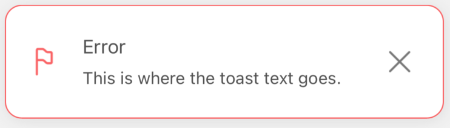
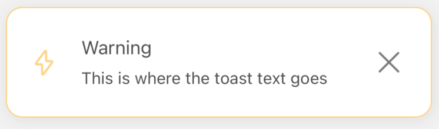
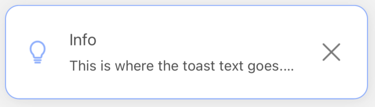

# 🔏 Default examples
<br/>

We prepared a lot of examples to help you understand how we can use our library. <br/>
First, let's focus on the most basic examples. It takes very little effort to make them work.<br/>
A few lines below, you will find all the code with explanations.<br/>
Let's go then!

## How to use the `notify()`

```jsx
import React, { useState } from 'react'
import { SafeAreaView } from 'react-native'
import { createNotifications, useNotificationController } from 'react-native-notificated'
import { SuccessButton } from '../components/basicExamples/SuccessButton'
import { ErrorButton } from '../components/basicExamples/ErrorButton'
import { WarningButton } from '../components/basicExamples/WarningButton'
import { InfoButton } from '../components/basicExamples/InfoButton'
import { ModifyButton } from '../components/basicExamples/ModifyButton'
import { RemoveButton } from '../components/basicExamples/RemoveButton'
import { styles } from './styles'

const { useNotifications, NotificationsProvider } = createNotifications({
  isNotch: true,
})

export const DefaultExamples = () => {
  const [id, setId] = useState('')
  const { notify } = useNotifications()
  const { remove, modify } = useNotificationController()

  return (
    <SafeAreaView style={styles.container}>
      <NotificationsProvider />
      <SuccessButton
        onPress={() =>
          setId(
            notify('success', {
              params: {
                description: 'This is where the toast text goes',
                title: 'Success',
              },
            }).id
          )
        }
      />
      <ErrorButton
        onPress={() =>
          notify('error', {
            params: {
              description: 'This is where the toast text goes. ',
              title: 'Error',
            },
          })
        }
      />
      <WarningButton
        onPress={() =>
          notify('warning', {
            params: {
              description: 'This is where the toast text goes',
              title: 'Warning',
            },
            config: {
              notificationPosition: 'center',
            },
          })
        }
      />
      <InfoButton
        onPress={() =>
          notify('info', {
            params: {
              description: 'This is where the toast text goes.',
              title: 'Info',
            },
          })
        }
      />
      <ModifyButton
        onPress={() =>
          modify(id, {
            params: {
              params: { id: id, title: 'Modified title', description: 'Modified description' },
            },
          })
        }
      />
      <RemoveButton onPress={() => remove(id)} />
    </SafeAreaView>
  )
}

```


At first, we need to import everything that is necessary for our component:

- `React` and `useState` - we will explain below why we need `useState` in this example
- `SafeAreaView`
- `createNotifications` - to set the basic config and pull out our `notify()` function
- `useNotificationController` - to pull out `remove()` and `modify()` functions (we will explain them below)
- `SuccessButton` and other buttons - are just styled `Text` components which imitates our buttons:

  ```typescript jsx
  import React, { VFC } from 'react'
  import { Text } from 'react-native'
  import { styles } from '../styles'

  type Props = {
  onPress: () => void
  }

  export const SuccessButton: VFC<Props> = ({ onPress }) => {
    return (
      <Text style={[styles.text, styles.success]} onPress={onPress}>
        Emit success
      </Text>
    )
  }
  ```

<br/>
<br/>

When the imports are applied, we initiate `createNotifications` and pick `useNotifications` and `NotificationsProvider` from the box.<br/>

- `useNotifications` - allows us to get access to the `notify()` function
- `NotificationsProvider` - it's a wrapper, like all others providers (ContextProvider, ApolloProvider etc.). This one is necessary to allow the library to operate within the prescribed scope. What is special here, is that we don't need to wrap scope in it. We can just put it as a self-closing component, and everything that is nested in the same wrapper as our provider will get access to our notifications.

<br/>
<br/>

Inside our `DefaultExamples` component we initiate `state` which will hold the notification `ID` for us. <br/>
Last thing, we need to do is to unpack `notify()`, `remove()` and `modify()` methods.<br/>
Those methods are crucial because:

- `notify()` - initiate every single notification. In the examples, we trigger it by `onPress`, but of course, it can be called in every other context you need, for example, after data fetching or after successful sign-in.
- `remove()` - externally remove triggered notification (it's not required, in the basic usage, but worth knowing)
- `modify()` - modify triggered notification (it's not required, in the basic usage, but worth knowing)<br/>

If you need more info on how those methods works please check the [BASIC USAGE](../basics/basic-usage.md) section.<br/>

As we said above, we trigger every notification by pressing the button. All we need to pass to the `onPress` event is:

```typescript jsx
() => notify('error', {
                params: {
                    description: 'This is where the toast text goes. ',
                    title: 'Error',
                },
            })
 ```

First argument is a notification type (`success/error/info/warning`) and the second is an object with settings, consisting of the two parts: `params` and `config` (check [Single Notification Config](../default-variants-config/props-config.md)).<br/>
Only description props is required, but usually, it's good to have also a title. >br/>
Our notification has been set, and it looks like that:



TADAM! Magic happens!! 🤗

<br/>
<br/>

## How to use the `error()` and the `modify()`

This is a little more complicated, but just a little (I promise!) <br/>
<br/>

All we need to do is to get chosen notification `ID` and set it in our `state`.<br/>
As you can see in the code below:

```typescript jsx
() =>
  setId(
    notify('success', {
      params: {
        description: 'This is where the toast text goes',
        title: 'Success',
      },
      config: {
        notificationPosition: 'center',
      },
    }).id
  )
```

We just wrapped `notify()` in our `setId` setter, and pulled `id` from the object returned by `notify()`.<br/>

Now it's time to:

### Pass the `id` to the `modify()` method:

```typescript jsx
    <ModifyButton
        onPress={() =>
          modify(id, {
            params: {
              params: { id: id, title: 'Modified title', description: 'Modified description' },
            },
          })
        }
    />
```

and add new settings which will overwrite those previously set in the notification (only one extra is `id` in the `params` object).<br/>
In other words, we can easily change any notification to a completely different one. <br/>
In the example above we changed only the `title` and the `description`, but we literally can change any value described in the [Single Notification Config](../default-variants-config/props-config.md) section.


### Pass the `id` to the `remove()` method:

```typescript jsx
<RemoveButton onPress={() => remove(id)} />
```

and... that's all... <br/>
We can simply call `remove()` method and pass `id` of the notification that should be manually and externally removed. <br/>
Why externally? Because internally (inside the notification), we have the close `X` icon.<br/>
It's just... let's call it 'CLOSE BUTTON' you can put outside the notification.

## Visualization of examples

Let's see the notifications we declared above:

<br/>

### Success notification


### Error notification


### Warning notification



### Info notification



### Modify notification

#### Before


#### And after


### Remove notification

#### Before


#### And after ;)


