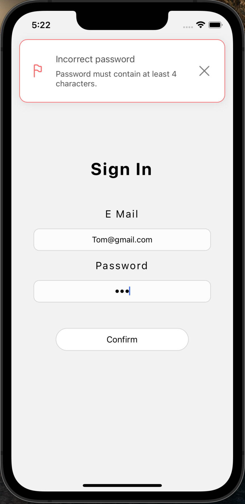

# 🔥 Redux example

<br/>

This example is quite different from the previous ones. <br/>
Our goal here is to show you how we can use RN Notifications library in real-life, in a more complicated environment.<br/>
For this reason, we built a dummy login screen.<br/>
In this example, we use the Redux Toolkit library.<br/>
Let's go step by step through it, and check where exactly notifications were triggered.

## Redux Example component

```typescript jsx
import React from 'react'
import { store } from '../redux/store'
import { Provider } from 'react-redux'
import { LoginForm } from '../components/loginForm/LoginForm'
import { createNotifications } from 'react-native-notificated'

const { NotificationsProvider } = createNotifications({
  isNotch: true,
})

export const ReduxExample = () => {
  return (
    <Provider store={store}>
      <NotificationsProvider />
      <LoginForm />
    </Provider>
  )
}
```

Redux Example is the main component, where we apply redux `Provider`, `NotificationsProvider` and render `LoginForm` component.<br/>

Let's check what happened here:

- we imported `React` (of course), `store` (previously created), redux `Provider`, `LoginForm` component (previously created) and well known `createNotifications`
- we didn't pick `useNotifications` hook. Only `createNotification`, because we're not triggering notifications here
- because `NotificationsProvider` is applied on the same level as `LoginForm` we have access to the notifications inside the form

<br/>

### Visualisation


<br/>

## Store

```typescript jsx
import { configureStore } from '@reduxjs/toolkit'
import formReducer from './reducers'

export const store = configureStore({
  reducer: {
    form: formReducer,
  },
})

export type RootState = ReturnType<typeof store.getState>
export type AppDispatch = typeof store.dispatch
```

In the `store.ts` file, we:

- import `configureStore` function, from `@reduxjs/toolkit`. That function is necessary to create the store.
- import `formReducer` (we will describe this function in the next paragraphs)
- create `store` with `configureStore` function, and pass `formReducer` as a `reducer` there, with a key `form`
- export two types: `RootState` and `AppDispatch` which we use to type `useDispatch` and `useSelector` hooks (we will come back to them soon)

<br/>

## Hooks

```typescript jsx
import { TypedUseSelectorHook, useDispatch, useSelector } from 'react-redux'
import type { RootState, AppDispatch } from './store'

export const useAppDispatch = () => useDispatch<AppDispatch>()
export const useAppSelector: TypedUseSelectorHook<RootState> = useSelector
```

We're now inside the `hooks.ts`.<br/>
Because we use `typescript`, we also want to type `useDispatch` and `useSelector` provided by `Redux`.
Thanks to that we received `useAppDispatch` function which is a typed `useDispatch` and `useAppSelector` which is typed `useSelector`
We will use them in the app, instead of using `useDispatch` and `useSelector`.

<br/>

## Reducers

This file (`reducers.ts`) is most important for us, because we use our `notify()` function here.

```typescript jsx
import { createSlice, Dispatch, PayloadAction } from '@reduxjs/toolkit'
import { notify } from '../components/loginForm/LoginForm'

type FormState = {
  login: string
  password: string
}

const initialState: FormState = {
  login: '',
  password: '',
}

export const formSlice = createSlice({
  name: 'form',
  initialState,
  reducers: {
    updateLogin: (state, action: PayloadAction<string>) => {
      state.login = action.payload
    },
    updatePassword: (state, action: PayloadAction<string>) => {
      state.password = action.payload
    },
    submit: (state) => {
      if (state.login.length < 4) {
        notify('error', {
          params: {
            title: 'Incorrect login',
            description: 'Login must contain at least 4 characters. ',
            style: {
              multiline: 2,
            },
          },
        })
      }
      if (state.password.length < 4) {
        notify('error', {
          params: {
            title: 'Incorrect password',
            description: 'Password must contain at least 4 characters. ',
            style: {
              multiline: 2,
            },
          },
        })
      }
      notify('success', {
        params: {
          title: 'Welcome again',
          description: 'You have successfully signed in. ',
          style: {
            multiline: 2,
          },
        },
      })
    },
  },
})

export const { updateLogin, updatePassword, submit } = formSlice.actions

export default formSlice.reducer

export const fetchUsers = (dispatch: Dispatch) => {
  setTimeout(() => dispatch(submit()), 2000)
}
```

In this file we:

- import function and types: `createSlice`, `Dispatch`, `PayloadAction` from the `@reduxjs/toolkit`
- and the `notify()` function from the `LoginForm` component. Why from there? In our opinion, it belongs there. We just want to use it in the `reducers.ts` file, that's why we have imported it here
- create the type for our `initialState` (type `FormState`), and create `initialState` which contains only `login` and `password`, because it's all we need in our simple form
- create `formSlice` which contains our reducers: `updateLogin`, `updatePassword` and `submit`. <br/>
  The `updateLogin` and the `updatePassword` are just updaters, which are responsible for our state change, but `submit` is a function that sends our data to the backend (Of course, as we can see, it is not doing that. It's just making simple validation, and check if the login and the password have at least 4 characters but shhh ;) ). <br/>
  If there is a problem with validation, our `error` notifications are used. If everything is fine, we use `success` notification.
- after that, we just export our reducer function and the reducer itself
- The last step is to create `fetchUsers` function, which imitates the time we need to get a response from the backend. In fact, we just wrap our `submit` here

This is where we used our `notify()` function. Let's go to the last file: `LoginForm` where we use all of that.

<br/>

## Login Form

```typescript jsx
import React from 'react'
import {
  NativeSyntheticEvent,
  SafeAreaView,
  Text,
  TextInput,
  TextInputChangeEventData,
  TouchableOpacity,
  View,
} from 'react-native'
import { fetchUsers, updateLogin, updatePassword } from '../../redux/reducers'
import { useAppDispatch, useAppSelector } from '../../redux/hooks'
import { styles } from './styles'
import { createNotifications } from 'react-native-notificated'

export const { notify } = createNotifications()

export const LoginForm = () => {
  const login = useAppSelector((state) => state.form.login)
  const password = useAppSelector((state) => state.form.password)
  const dispatch = useAppDispatch()

  const handleLoginChange = (e: NativeSyntheticEvent<TextInputChangeEventData>) => {
    dispatch(updateLogin(e.nativeEvent.text))
  }

  const handlePasswordChange = (e: NativeSyntheticEvent<TextInputChangeEventData>) => {
    dispatch(updatePassword(e.nativeEvent.text))
  }

  return (
    <SafeAreaView style={styles.container}>
      <Text style={styles.title}> Sign In </Text>
      <View style={styles.form}>
        <Text style={styles.label}>E Mail</Text>
        <TextInput onChange={handleLoginChange} value={login} style={styles.input} />
        <Text style={styles.label}>Password</Text>
        <TextInput
          onChange={handlePasswordChange}
          value={password}
          style={styles.input}
          secureTextEntry
        />
        <TouchableOpacity style={styles.button} onPress={() => fetchUsers(dispatch)}>
          <Text style={styles.buttonText}>Confirm</Text>
        </TouchableOpacity>
      </View>
    </SafeAreaView>
  )
}
```

So again at the beginning, we need to import everything we need:

- `react native` components and event
- our reducers (please remember that `fetchUsers` is in fact `submit` with `setTimeout`)
- our hooks, because we use them instead of `useDispatch` and `useSelector`
- styles (previously prepared)
- and `createNotifications` to get access to the `notify()`

After that we pick and export `notify()` (we're using it in the `reducers.ts` file).

Our `LoginForm` component consists of:

- `login` (that we pull from the state)
- `password` (that we pull from the state)
- `dispatch` function
- `handleLoginChange` function (where we dispatch `updateLogin`)
- `handlePasswordChange` function (where we dispatch `updatePassword`)

In fact, that is all...

We need to pass the function to the inputs and the submit button.

Now let’s take a look at our notifications when we provide an invalid email or password vs. when we enter valid data.

## Incorrect Login


<br/>

## Incorrect Password



<br/>

## You have successfully logged in


<br/>
